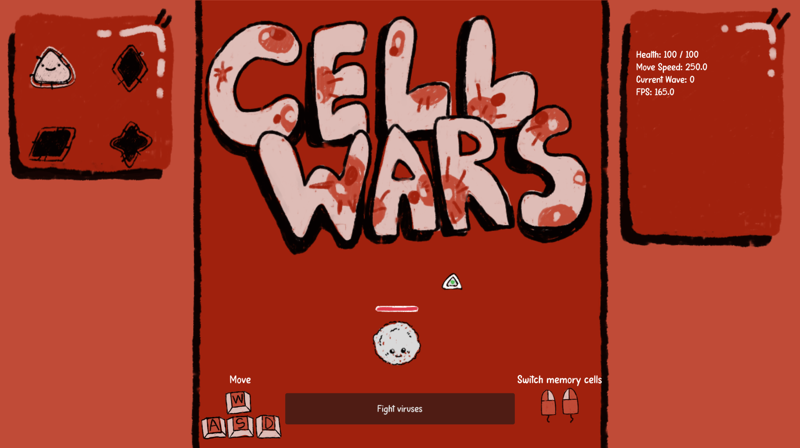
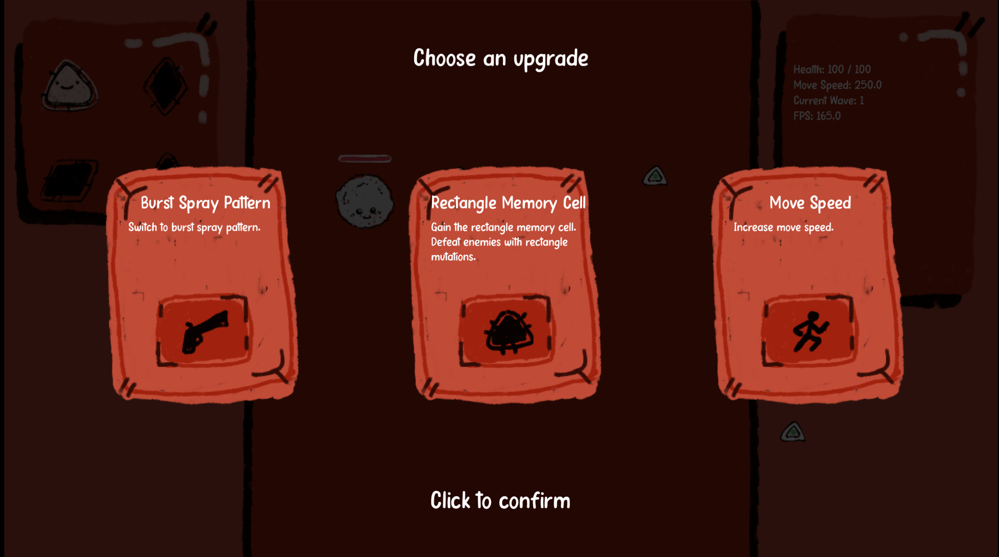
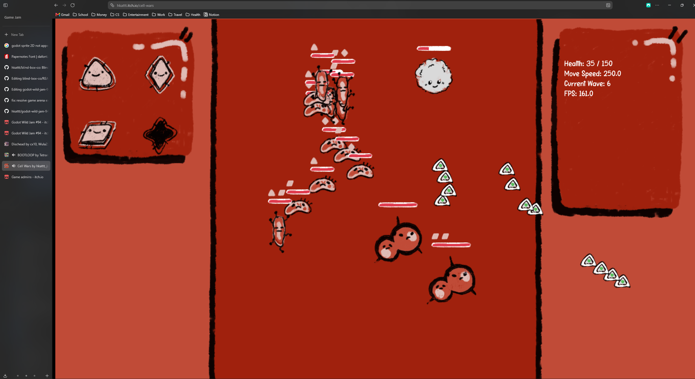

# Godot Wild Jam 94

## Overview
Cell Wars was made using Godot 4.7 (previously 4.6.3) and GDScript for the [Godot Wild Jam 94](https://itch.io/jam/godot-wild-jam-94). The theme of the game jam was was `MUTATION`. The game jame also included the  following wildcards:
- `Disassembly required`: Demolish, break, or otherwise disassemble things.
- `Checkout`: Have stuff to buy in your game.
- `I like turtles`: Include a turtle.

We implemented the `Checkout` wild card.

Cell Wars is a bullet hell game. You play as a lone white blood cell that must survive against an endless horde of viruses. The viruses develop mutations to overcome your resistance, but grow stronger by obtaining memory cells, gun upgrades, and other buffs.

## Controls

All you have to do is move around and switch between the memory cells. The white blood cell is shoot continuously, following the aim of your mouse.

- Move: WASD

- Cycle memory cell: Left and right mouse buttons

## Images

  
  
  
 
## Dependencies

The only dependency is the [Godot 4 game engine](https://godotengine.org/). 

## Setup the Project Locally

To setup the project locally, simply clone the repository and open the project in Godot. 

## Inspiration
- [Bootloop](https://tetraminose.itch.io/bootloop)
- [Dischead](https://cx10.itch.io/dischead)

## Asset References
- **Letter Flow**. Font. Licence: Free for personal use. Retrieved from: https://www.dafont.com/papernotes.font
- **szegvari**. Action music. Licence: Creative Commons 0. Retrieved from: https://freesound.org/people/szegvari/sounds/608882/
- **wobesound**. Click SFX. Licence: Creative Commons 0. Retrieved from: https://freesound.org/people/wobesound/sounds/488381/
- **Raclure**. Damage SFX. Licence: Creative Commons 0. Retrieved from: https://freesound.org/people/Raclure/sounds/458867/
- **gamer500**. Death SFX. Licence: Creative Commons 0. Retrieved from: https://freesound.org/people/gamer500/sounds/692084/

## Code References
- **Soma Animus**. Global audio player. Retrieved from: https://www.youtube.com/watch?v=lILnUD3xph8
- **MakerTech**. Health Bar. Retrieved from: https://www.youtube.com/watch?v=UEJcUnq2dfU